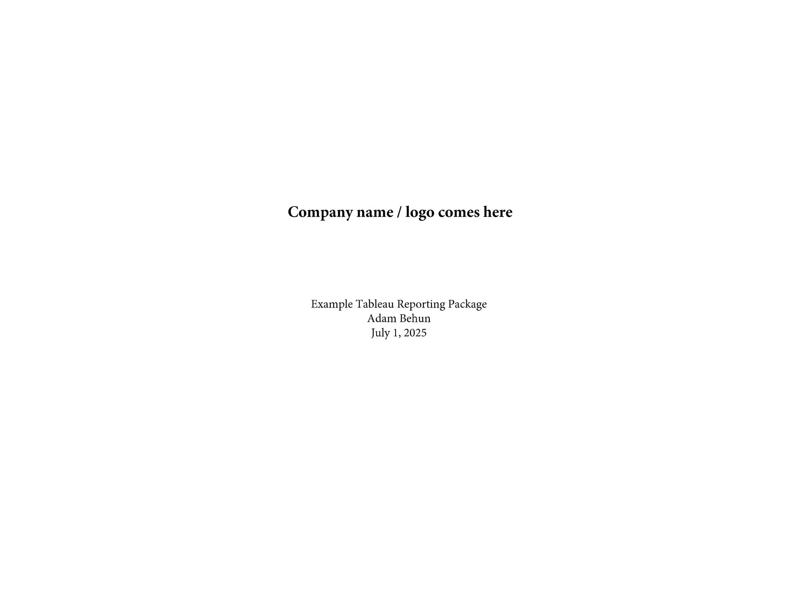

# Adam Behun | Software for clinic's administrative tasks

# Prior Authorization AI Voice Agent

**Live Demo**: https://prior-authorization-voice-agent-divine-shape-1935.fly.dev/
**Source Code**: https://github.com/Adam-Behun/MyRobot

- ✅ **OpenAI**: Large Language Model
- ✅ **ElevenLabs**: Text-to-speech
- ✅ **Deepgram**: Speech-to-text
- ✅ **MongoDB**: Mock database
- ✅ **FastAPI**: Async backend
- ✅ **LiveKit**: WebRTC data transport
- ✅ **Pipecat**: Voice application open source orchestration

# Dental Kiosk - Digital Check-in Solution

**Live Demo**: https://frontend-production-6e9f.up.railway.app/
**Source Code**: https://github.com/Adam-Behun/DentalKiosk

- ✅ **Instant self-check-in** - Patients check in themselves in under 2 minutes
- ✅ **Price transparency** - See exact costs before treatment
- ✅ **Secure payments** - Pay co-payments instantly via Stripe
- ✅ **Reduced staff workload** - Automates routine check-in tasks
- ✅ **Better patient satisfaction** - Modern, efficient experience

# Example Tableau Report

  

## Other Data Analysis Repos
- [NYC Taxi Rides Analysis](https://github.com/Adam-Behun/supervised-ml-to-predict-tips)
- [House Price ML Competition](https://github.com/Adam-Behun/supervised-machine-learning/blob/main/house-price-competition/algorithms/top-solution.ipynb)
- [Principal Component Analysis to Recognize Hand-Written Digits](https://github.com/Adam-Behun/supervised-machine-learning/blob/main/mnist-competition/algorithms/pca_with_models.ipynb)
- [SQL Preparation](https://github.com/Adam-Behun/sql-preparation)