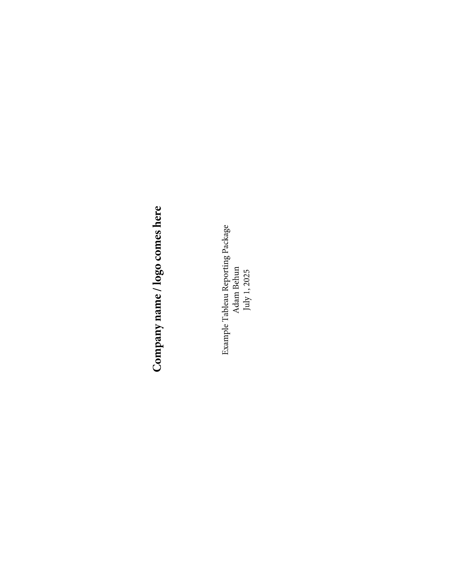
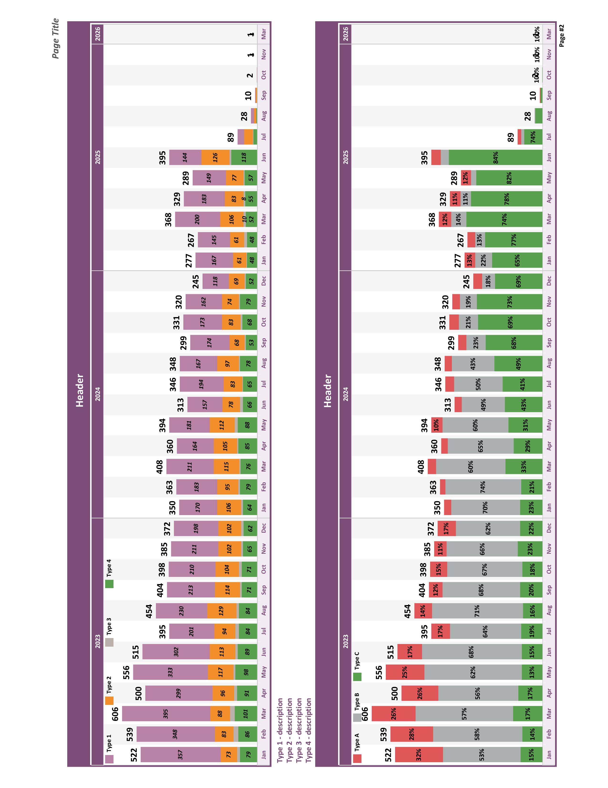
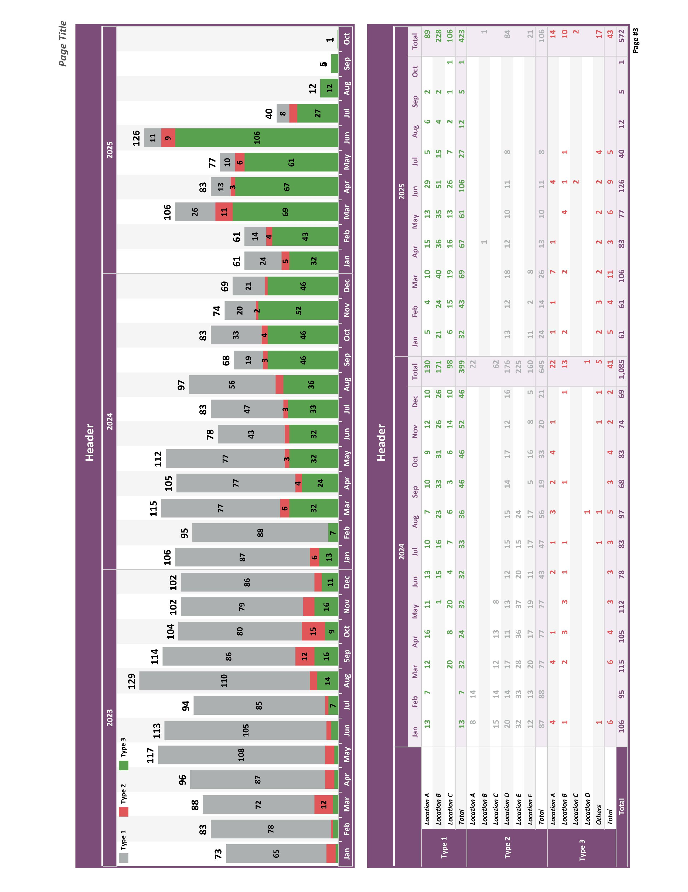
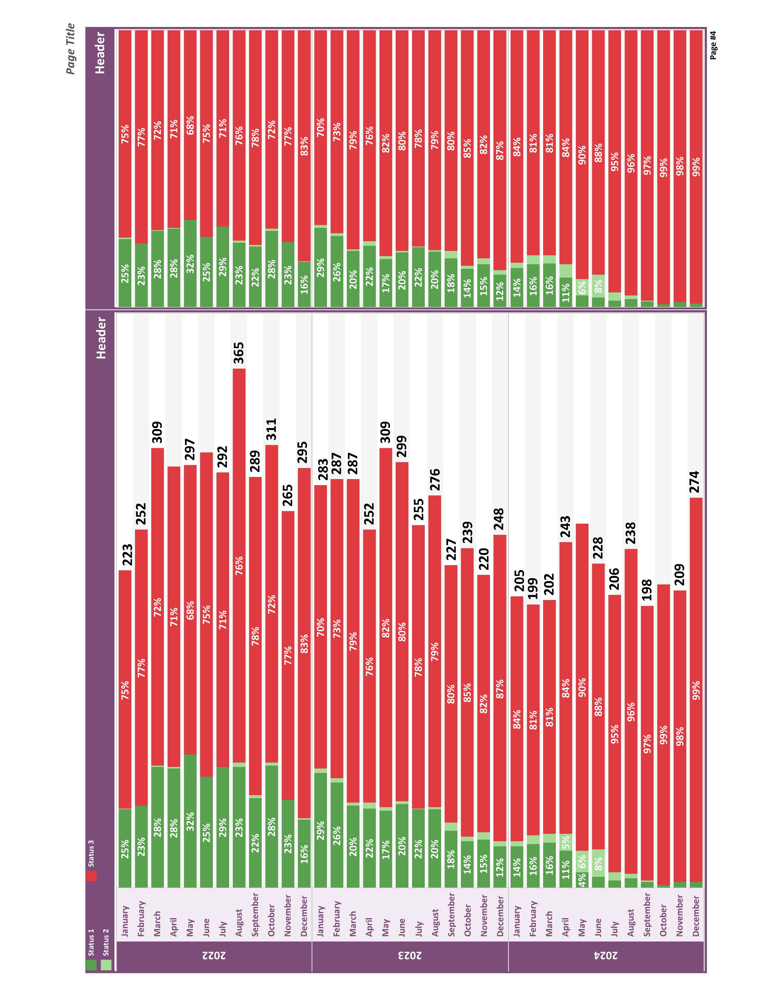

# Adam Behun | Software for clinic's administrative tasks

## **[Prior Authorization AI Voice Agent](https://github.com/Adam-Behun/MyRobot)**  
### Navigate IVR, Speak with insurance representative, Verify patients' eligibility, Update EHR, Store all conversation transcripts
#### Technical Details
- **OpenAI**: Large Language Model
- **ElevenLabs**: Text-to-speech
- **Deepgram**: Speech-to-text
- **MongoDB**: Mock database
- **FastAPI**: Async backend
- **LiveKit**: WebRTC data transport
- **Pipecat**: Voice application open source orchestration

**Future Enhancements**: Handling IVR, navigating complex cases

## **[Patient Check-in KIOSK](https://github.com/Adam-Behun/DentalKiosk)**
### Collect accurate co-payments, Simplify patient check-ins, Track in-clinic wait times
#### Technical Details
- **Docker**: Containerized deployment for consistent backend/frontend setup.
- **Stripe**: Secure payment processing with webhook integration.
- **Next.js**: Responsive frontend for patient interaction.
- **PostgreSQL**: Stores appointment and payment data.

**Future Enhancements**: EDI Integration to Clearinghouse adding patient's deductible & showing accurate patient balance before the appointment.

## Data Analysis Repos
**[NYC Taxi Rides Analysis](https://github.com/Adam-Behun/supervised-ml-to-predict-tips)**

**[House Price ML Competition](https://github.com/Adam-Behun/supervised-machine-learning/blob/main/house-price-competition/algorithms/top-solution.ipynb)**

**[Principal Component Analysis to Recognize Hand-Written Digits](https://github.com/Adam-Behun/supervised-machine-learning/blob/main/mnist-competition/algorithms/pca_with_models.ipynb)**

**[SQL Preparation](https://github.com/Adam-Behun/sql-preparation)**

  

    
    
    
    
  

